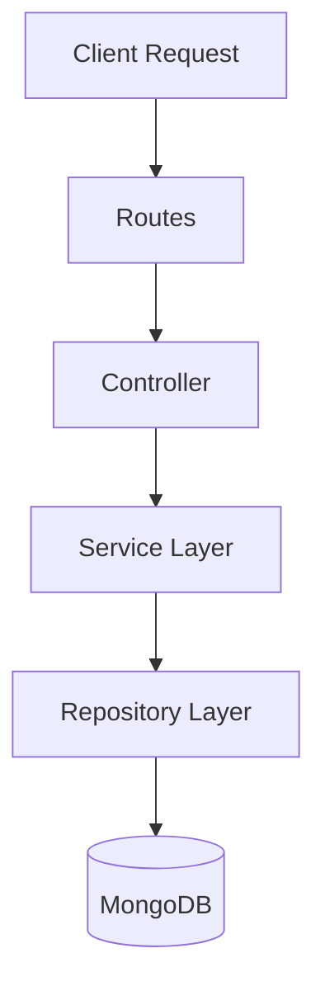
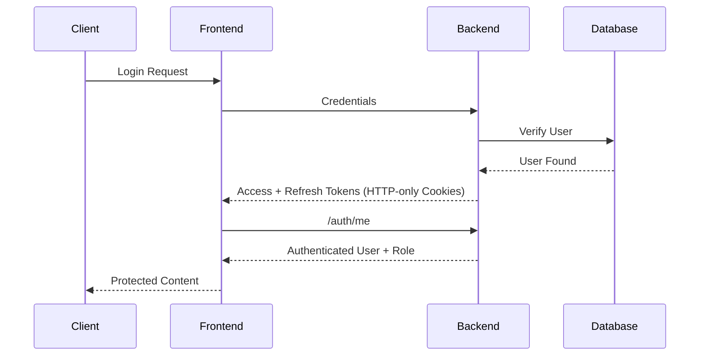

# 🏋️‍♂️ FitnessWiki

A full-stack MERN fitness planner web application that helps users generate, preview, and manage structured workout plans based on their fitness goals, experience level, and available equipment.

Built with a strong focus on:
- Scalable backend architecture
- Secure authentication flows
- Role-based authorization
- Clean state management
- Production-oriented engineering practices
- Testing and validation

---

## 🚀 Live Demo

### 🌐 Frontend
https://fitness-wiki-frontend.onrender.com

### 📦 Repository
https://github.com/Vishwas2607/fitness-wiki-mern.git

---

# ✨ Features

## 🔐 Authentication & Security

- User Registration & Login
- JWT Authentication
- Access + Refresh Token Rotation
- HTTP-only Secure Cookies
- Persistent Authentication using `/auth/me`
- Role-Based Access Control (RBAC)
- Protected Routes
- Single Session Enforcement
- Secure Logout Flow
- Authentication State Management using TypeScript Enums

---

## 🏋️ Workout Planning Features

- Recommended Workout Plans
- Custom Workout Plan Generation
- Workout Preview Before Saving
- Save Workout Plans
- Fetch Saved Plans
- Dynamic Exercise Filtering
- Equipment-aware Workout Generation
- Goal-based Workout Selection
- Admin-managed Global Exercise Dictionary

---

## 🧠 Frontend Engineering Features

- Three-State Authentication Flow
  - `LOADING`
  - `AUTHENTICATED`
  - `UNAUTHENTICATED`

- `verifyAuth()` based session validation
- Full-page loader during auth verification
- Role-aware route protection
- Encapsulated auth state management
- `useCallback` optimized auth verification
- React Query server-state handling
- Zod-based form validation
- Responsive UI
- Dark Theme Support
- Disabled submit buttons until valid input

---

## 🛡️ Backend Engineering Features

- Layered Architecture
- Repository Pattern
- Service Layer Abstraction
- Express v5 Native Async Error Handling
- Global Error Handling Middleware
- Request Validation using Zod
- Environment-based Logging using Morgan
- Helmet Security Middleware
- Rate Limiting (Global + Auth-specific)

---

# 🧪 Testing

Authentication system is fully tested with:

- ✅ 48 Total Tests Passing
- ✅ Unit Tests
- ✅ Integration Tests
- ✅ Refresh Token Flow Testing
- ✅ Cookie Authentication Testing
- ✅ Validation Testing
- ✅ Error Handling Testing

### Testing Stack

- Vitest
- Supertest
- MongoMemoryServer

### Coverage Breakdown

| Test Type | Count |
|---|---|
| Auth Service Unit Tests | 28 |
| Auth Flow Integration Tests | 20 |

---

# 🏗️ Architecture

Backend follows clean layered architecture:

```text
Model → Repository → Service → Controller → Routes
```

---

# 📊 Backend Request Flow



---

# 🔐 Authentication Flow



---

# ⚙️ Authentication State Management

FitnessWiki uses a secure backend-driven authentication verification strategy.

Instead of relying on:
- LocalStorage authentication
- Direct frontend-only auth state

The application verifies authentication status using:

```text
/auth/me
```

This approach ensures:

- Persistent login after refresh
- No UI flickering
- Secure auth verification
- Centralized role handling
- Controlled auth state updates

### Authentication States

```ts
enum AuthStatus {
  LOADING,
  AUTHENTICATED,
  UNAUTHENTICATED
}
```

Protected route layouts render:

| State | Result |
|---|---|
| LOADING | Full-page loader |
| AUTHENTICATED | Protected routes |
| UNAUTHENTICATED | Redirect/Login |

---

# 🧱 Database Schemas

## Current Schemas

### User
Stores authentication and profile information.

### GlobalExercise
Admin-managed exercise dictionary used for workout generation.

### WorkoutPlan
Stores generated workout plans.

### SavedWorkoutPlan
Stores user-confirmed workout plans with exercise references.

---

## Planned Schemas

### WorkoutLog
Planned for:
- Workout tracking
- Progress analytics
- Volume tracking
- Future recommendation improvements

---

# 🚀 Tech Stack

## Frontend

- React
- TypeScript
- TailwindCSS
- React Query
- Context API
- Zod

---

## Backend

- Node.js
- Express.js v5
- MongoDB
- Mongoose
- JWT Authentication
- HTTP-only Cookies
- Helmet
- Morgan
- Rate Limiting

---

## Testing

- Vitest
- Supertest
- MongoMemoryServer

---

## Deployment

| Service | Platform |
|---|---|
| Frontend | Render |
| Backend | Render |
| Database | MongoDB Atlas |

---

# 📂 Project Structure

## Backend

```text
backend/
│
├── config/
├── controllers/
├── middleware/
├── models/
├── repositories/
├── routes/
├── services/
├── tests/
├── utils/
├── app.js
└── server.js
```

---

## Frontend

```text
frontend/
│
├── src/
│   ├── components/
│   ├── context/
│   ├── hooks/
│   ├── layouts/
│   ├── pages/
│   ├── services/
│   ├── types/
│   └── App.tsx
│
└── lib/
```

---

# ⚡ Express v5 Native Async Error Handling

FitnessWiki uses Express v5 native async error handling.

Benefits:

- No `express-async-handler`
- No custom async wrappers
- Cleaner controller code
- Centralized error handling
- Better maintainability

---

# 🔥 Security Measures

- Helmet
- HTTP-only Cookies
- JWT Rotation
- Role-Based Authorization
- Zod Validation
- Global Error Handling
- Rate Limiting
- Secure Auth Verification
- Encapsulated Auth State Logic

---

# 📸 Screenshots


---

# ⚙️ Environment Variables

## Frontend

```env
VITE_BACKEND_URL=
```

---

## Backend

```env
PORT=
CLIENT_URL=
MONGO_URI=
JWT_SECRET=
JWT_REFRESH_SECRET=
ADMIN_SECRET=
NODE_ENV=
```

---

# 🛠️ Installation & Setup

## 1️⃣ Clone Repository

```bash
git clone https://github.com/Vishwas2607/fitness-wiki-mern.git
```

---

## 2️⃣ Backend Setup

```bash
cd backend
npm install
npm run dev
```

---

## 3️⃣ Frontend Setup

```bash
cd frontend
npm install
npm run dev
```

---

# 🎯 Planned Features

- Workout Logging System
- Progress Analytics Dashboard
- Smarter Score-based Exercise Selection
- Recovery-aware Exercise Balancing
- Advanced Recommendation Logic

---

# 💡 Engineering Highlights

This project demonstrates:

- Production-style authentication architecture
- Clean backend separation of concerns
- Repository + Service layer implementation
- Secure cookie-based auth
- RBAC implementation
- Persistent authentication strategy
- Integration and unit testing
- Validation-driven API design
- Scalable folder structure
- Express v5 async error architecture
- Strong frontend auth-state management patterns

---

# 📌 Project Status

## ✅ Completed & Deployed

FitnessWiki is fully functional and deployed with:
- Authentication system
- Workout generation
- Save workout flow
- RBAC
- Secure backend architecture
- Tested auth flows
- Responsive frontend

Future improvements will focus on analytics and workout tracking features.
